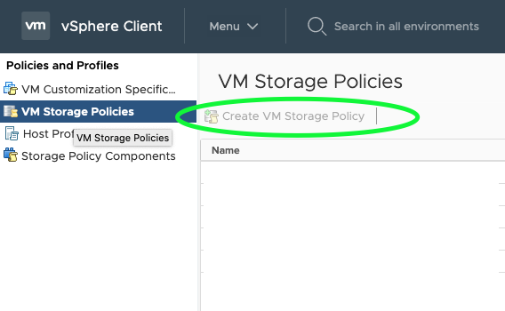

# vSphere Container Storage Interface Driver

This katalog deploy the vSphere container storage interface driver on a VMware Kubernetes cluster backed by VCenter >= v67u3.

Follow all the prerequisites from `vsphere-cm` modules.

## Setting credentials

Credential are set via secret, patch it via Kustomize:

```yaml
apiVersion: v1
kind: Secret
metadata:
  name: vsphere-config-secret
  namespace: kube-system
stringData:
  csi-vsphere.conf: |
    [Global]
    cluster-id = "demo-cluster-id"
    [VirtualCenter "1.1.1.1"]
    insecure-flag = "true"
    user = "Administrator@vsphere.local"
    password = "password"
    port = "443"
    datacenters = "datacenter"

type: Opaque
```

`cluster-id` represents the unique cluster identifier. Each kubernetes cluster should have it's own unique cluster-id set in the csi-vsphere.conf file.

## Install

After setting all prerequisites and password, you can apply all manifests to the cluster.

## Check that everything is working after installation:

Run these commands, the output should be similar:

```bash
# kubectl get CSINode
NAME        CREATED AT
k8s-node1   2019-06-01T00:50:26Z
k8s-node2   2019-06-01T00:50:38Z
k8s-node3   2019-06-01T00:50:26Z
k8s-node4   2019-06-01T00:50:25Z
```

## Define a storage class

Now you will need to set a Storage Policy in VCenter to define which datastore will be used by volumes:



Follow the wizard to select the storage. Storage is selected using vSAN or using tags on Datastores. After the procedure you will have a storage policy that shows some disk under `Storage Compatibility`.

Create your storageclass:

```yaml
kind: StorageClass
apiVersion: storage.k8s.io/v1
metadata:
  name: vsphere
  annotations:
    storageclass.kubernetes.io/is-default-class: "true"
provisioner: csi.vsphere.vmware.com
parameters:
  storagepolicyname: "your-awesome-storage-policy-in-vcenter"
  fstype: ext4
```


